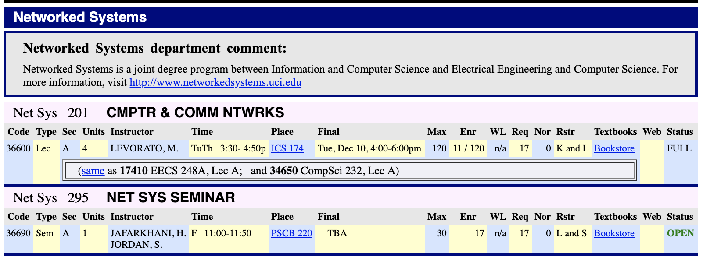

# reg-uci-api
To get class information from [UCI REG](https://www.reg.uci.edu/perl/WebSoc)



## Get Started

Try to access course info for Networked System major via link: [https://uci-reg-api.herokuapp.com/courses?Dept=net%20sys](https://uci-reg-api.herokuapp.com/courses?Dept=net%20sys).

Then you should get the course info in JSON format:

```json
[
  {
    "title": "Net Sys 201 CMPTR & COMM NTWRKS",
    "subCourses": [
      {
        "Code": "36600",
        "Type": "Lec",
        "Sec": "A",
        "Units": "4",
        "Instructor": "LEVORATO, M.",
        "Time": "TuTh    3:30- 4:50p",
        "Place": "ICS 174",
        "Final": "Tue, Dec 10, 4:00-6:00pm",
        "Max": "120",
        "Enr": "11 / 120",
        "WL": "n/a",
        "Req": "17",
        "Nor": "0",
        "Rstr": "K and L",
        "Textbooks": "Bookstore",
        "Web": "",
        "Status": "FULL"
      }
    ]
  },
  {
    "title": "Net Sys 295 NET SYS SEMINAR",
    "subCourses": [
      {
        "Code": "36690",
        "Type": "Sem",
        "Sec": "A",
        "Units": "1",
        "Instructor": "JAFARKHANI, H.JORDAN, S.",
        "Time": "F   11:00-11:50",
        "Place": "PSCB 220",
        "Final": "TBA",
        "Max": "30",
        "Enr": "17",
        "WL": "n/a",
        "Req": "17",
        "Nor": "0",
        "Rstr": "L and S",
        "Textbooks": "Bookstore",
        "Web": "",
        "Status": "OPEN"
      }
    ]
  }
]
```

Change query field `Dept` to different department, such as `eecs`, `compsci`, you can 
access those department's courses.

## More Options

In addition to changing `Dept` to access courses info, there are other options you
can set up to get more precise course info. Here are all the options (Including default values):

```
{
  'YearTerm': '2019-92',
  'ShowComments': 'on',
  'ShowFinals': 'on',
  'Breadth': 'ANY',
  'Dept': 'NET SYS',
  'CourseNum': '',
  'Division': 'ANY',
  'CourseCodes': '',
  'InstrName': '',
  'CourseTitle': '',
  'ClassType': 'ALL',
  'Units': '',
  'Days': '',
  'StartTime': '',
  'EndTime': '',
  'MaxCap': '',
  'FullCourses': 'ANY',
  'FontSize': '100',
  'CancelledCourses': 'Exclude',
  'Bldg': '',
  'Room': '',
  'Submit': 'Display Web Results'
}
```

Above are all options that [Web Reg](https://www.reg.uci.edu/perl/WebSoc) would accept, but I would recommend 
you to only setup `YearTerm`, `Dept`, `CourseTitle`, `CourseCodes` which are much more useful than others.

### Default Values

By default, `YearTerm` is set to `2019-92`, and `Dept` is set to `Net SyS`, other default values are shown above.

### Option Values
Some option values are static and predefined by [web Reg](https://www.reg.uci.edu/perl/WebSoc).
To access those option values, you can send GET request to [https://uci-reg-api.herokuapp.com/options](https://uci-reg-api.herokuapp.com/options) 
to view all possible option values.

Or [Click here to view sample](./samples/options.json)

## API

### /courses

GET https://uci-reg-api.herokuapp.com/courses

Results: [Sample](./samples/courses.json)

### /options

GET https://uci-reg-api.herokuapp.com/options

Results: [Sample](./samples/options.json)

## Related Projects

### uci-reg-cli
[Github Repo](https://github.com/Haixiang6123/uci-reg-cli)

View UCI courses info in your terminal.
